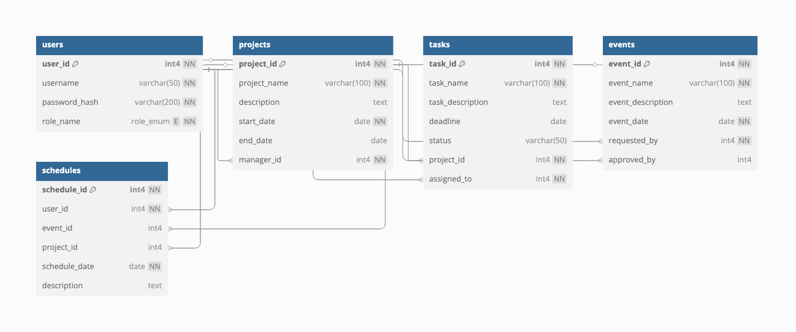

# Software engineering project

## Link to the website:

[preginex.fun](https://preginex.fun)

## For admin rights, use the following credentials:

- **Username:** `admin`
- **Password:** `admin`

if you sign in with google, you'll have worker's access rights for now.

## Database UML diagram:



- PDF version [here](documentation/uml_diagram.pdf)
- Also check out the docs for this database [here](https://dbdocs.io/awerks/software_project)

## Software requirements specification

- [Google Docs](https://docs.google.com/document/d/1X-tgVVlT9g7ckr5P7b86xfEdJoca1BdAu7juNzQIzRM/edit?tab=t.0#heading=h.cvzov8a88e28)
- [Overleaf](https://www.overleaf.com/8652163511gmrztypckwxz#f8ed04)
- See compiled version [here](documentation/software_requirements.pdf)

## Getting started with the project

### Clone the repository

```bash
git clone https://github.com/avalean07/se_project_1000 && cd se_project_1000
```

### Create conda environment

```bash
conda create -n se_project python=3.12 --file requirements.txt
```

## Set environment variables (provided in google docs)

- `SMTP_SERVER`
- `SMTP_PORT`
- `SMTP_USERNAME`
- `SMTP_PASSWORD`
- `GOOGLE_CLIENT_ID`
- `GOOGLE_CLIENT_SECRET`
- `DATABASE_PUBLIC_URL`

```bash
conda env config vars set myvar=value
```

### Restart the conda environment

```bash
conda deactivate
conda activate se_project
```

### Run the server

```bash
flask run --debug
```

### Access the local server

The server can be accessed at [http://127.0.0.1:5000/](http://127.0.0.1:5000/)

## P.S

Add your pictures to static/images in the format of `<team-memberX>.jpg`

## Deployment

The project is deployed at [Railway](https://railway.com/). Each time the code is pushed to the main branch, the website will be updated automatically.
